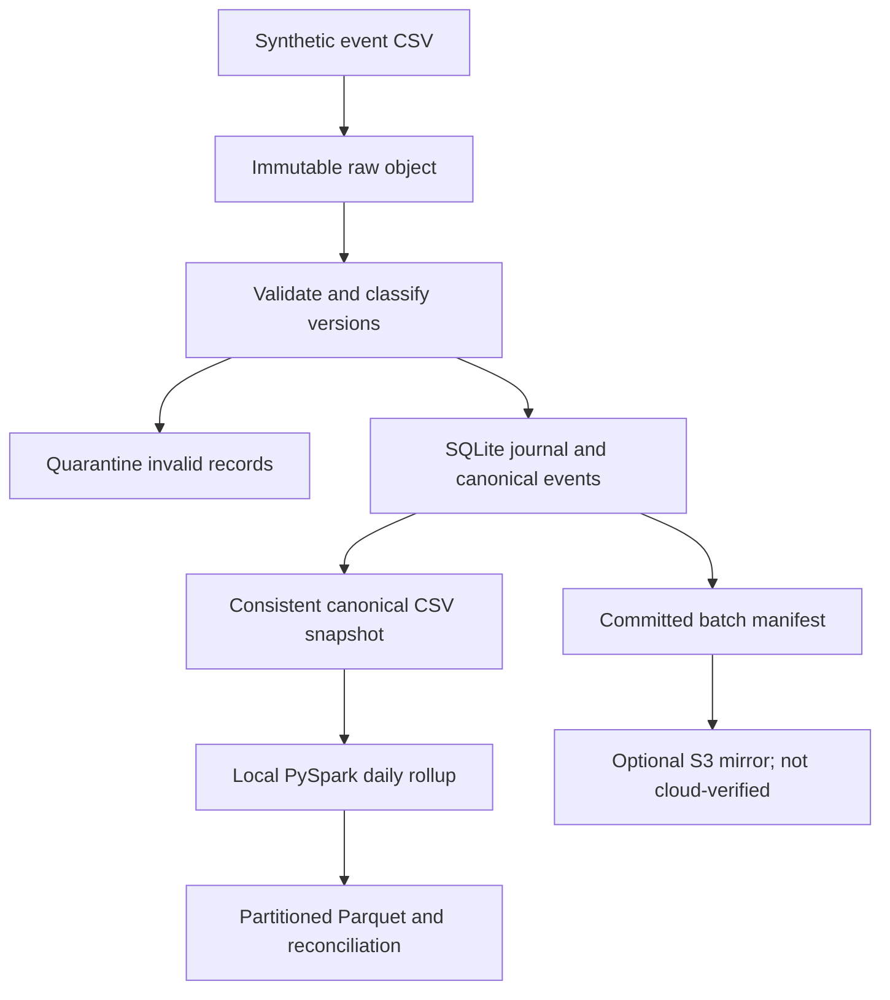

# Replayable retail event pipeline

**Land raw retail events once, isolate bad records, apply corrections safely, and reconcile a Spark sales rollup.**

This improves the existing cloud data platform starter. It focuses on ingestion and recovery; the warehouse
model is implemented separately in [retail-elt-warehouse](https://github.com/SaiHemanthRaj/retail-elt-warehouse).
The original starter described more services than it implemented. Its broad claims have been replaced
with explicit execution evidence and boundaries.

**Verified locally:** Python ingestion, crash/retry behavior, SQLite journal, PySpark 4.0.1 rollup, and Parquet
readback. **Contract-tested:** optional S3 publishing through AWS SDK stubs. **Unverified:** real S3 access,
Airflow execution, Terraform apply, and cloud deployment. No GCP implementation is claimed.

## Review in 60 seconds

| Problem | Implemented behavior |
|---|---|
| Duplicate delivery | SHA-256 batch registry and event-level version checks |
| Bad rows | Quarantine with source line, row, and reason |
| Corrected source events | Newer `updated_at` replaces canonical event; stale versions cannot overwrite |
| Partial failure | Raw artifacts remain; journal rolls back; replay can repair a missing post-commit manifest |
| Trusted aggregate | Spark reads the canonical snapshot, reconciles cents, writes and reads Parquet |
| Evidence | [Ingestion report](examples/run_report.json), [Spark report](examples/spark_report.json), [tests](examples/verification.txt) |

## Architecture



## Run the ingestion

Python 3.11 or 3.12. No third-party package or cloud account is needed for ingestion.

```bash
python -m pipeline.ingest --source data/sample/events.csv
python -m pipeline.ingest --source data/sample/events.csv
```

The second invocation reports `replayed`. The first produces:

| Measure | Value |
|---|---:|
| Source rows | 5,150 |
| New canonical events | 5,000 |
| Applied newer versions | 20 |
| Exact duplicates | 100 |
| Quarantined invalid rows | 30 |

The application checks that inserts + updates + duplicates + stale rows + quarantined rows equals source rows.
`artifacts/journal.sqlite` is the authority for local commit state; the mere presence of an object is not
proof that a batch committed. `artifacts/canonical.csv` holds the latest event per ID.

## Run Spark and tests

Spark requires Java 17 or later on PATH. Use a virtual environment; on Windows use its Scripts activation.

```bash
python -m venv .venv
source .venv/bin/activate
python -m pip install -r requirements.txt -r requirements-aws.txt -r requirements-spark.txt
python -m pytest -q
python -m pipeline.spark_rollup
```

The verified Spark output is **80 daily/store groups**, **5,000 canonical events**, and
**32,515,578 revenue cents**, with exact source-to-rollup reconciliation and partitioned Parquet readback.
See [sample output](examples/daily_sales_sample.csv).

If Spark and AWS packages are not installed, their tests explicitly skip; do not describe that as full
validation. The captured evidence includes both suites. `SPARK_LOCAL_IP=127.0.0.1` can help when a machine's
hostname cannot be resolved. Spark runs on `local[2]`; distributed/cloud execution is not measured.

## Event contract and business rule

Each event has `event_id`, `event_date`, `store_id`, `product_id`, `quantity`, `unit_price_cents`, and a source
`updated_at` in naive UTC. IDs and dates are validated. Quantities must be positive; prices nonnegative.
Money stays in integer cents. An identical event version is a duplicate; conflicting values at the same
timestamp go to quarantine. Within a batch, rows are processed in source order.

```python
if previous and previous[-1] > event[-1]:
    stale += 1
    continue
```

Batch curated files are accepted **change versions**, not a full table snapshot. Summing all curated files
would double-count corrected sales. Spark deliberately reads the canonical snapshot exported from SQLite.

## Optional AWS mirror and orchestration

[S3 publishing](pipeline/publish_s3.py) checks local artifact SHA-256 hashes, uploads immutable objects with
conditional writes, and writes the manifest last. It uses the SDK default credential chain, server-side
encryption, and bounded SDK retries. The S3 manifest signals completed mirror publication.

```bash
# Export AWS_S3_BUCKET and AWS_REGION; configure your own SDK credentials securely.
python -m pipeline.publish_s3 --batch-hash <hash-from-run-report>
```

There is no verified S3 bucket or cloud deployment. See [cloud boundaries](docs/cloud.md) for least-privilege
permissions, costs, and the unexecuted Airflow/Terraform scaffolds. The adapter uses
[AWS conditional writes](https://docs.aws.amazon.com/AmazonS3/latest/userguide/conditional-writes.html).

## Tests, decisions, and limits

Tests cover replay, source row conservation, invalid records, stale/conflicting updates, bad schema,
immutable collisions, failure before commit, recovery after commit, S3 write/read contracts, checksums,
manifest ordering, and a real local Spark job with Parquet readback.

SQLite serializes local writers with `BEGIN IMMEDIATE`; this project is not a distributed ingestion service.
Raw input and normalized output are kept for auditability. Objects orphaned by a failed attempt may remain;
they must not be consumed without a committed journal/manifest. Retention/garbage collection is not implemented
locally. Inputs are read in memory, so batch size must remain modest.

No authentication service, PII handling, continuous scheduler, or production SLA is claimed. The S3 mirror
preserves source/accepted/quarantine objects; it does not replicate the canonical database or Spark output.
Next improvements: a real sandbox S3 smoke test, an executed Airflow integration, streamed input,
partition-aware state management, and explicit deletion/return semantics.

## Structure and attribution

`pipeline/` holds ingestion, S3 mirror, and Spark aggregation; `data/` holds deterministic synthetic fixtures;
`tests/` exercises behavior; `examples/` contains captured results; `airflow/` and `terraform/` contain
optional, unverified cloud scaffolds. `.env.example` documents exported variables; `.env` is not auto-loaded.

Code: MIT. Synthetic data: CC0 1.0. [Starter migration and attribution](ATTRIBUTION.md).
